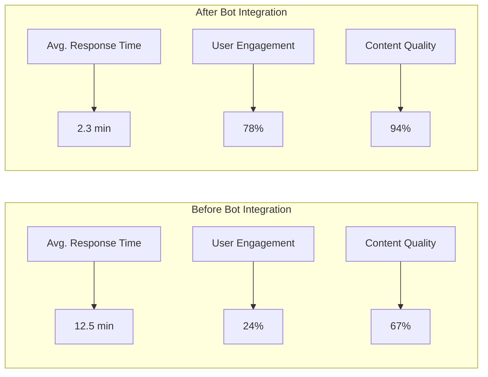
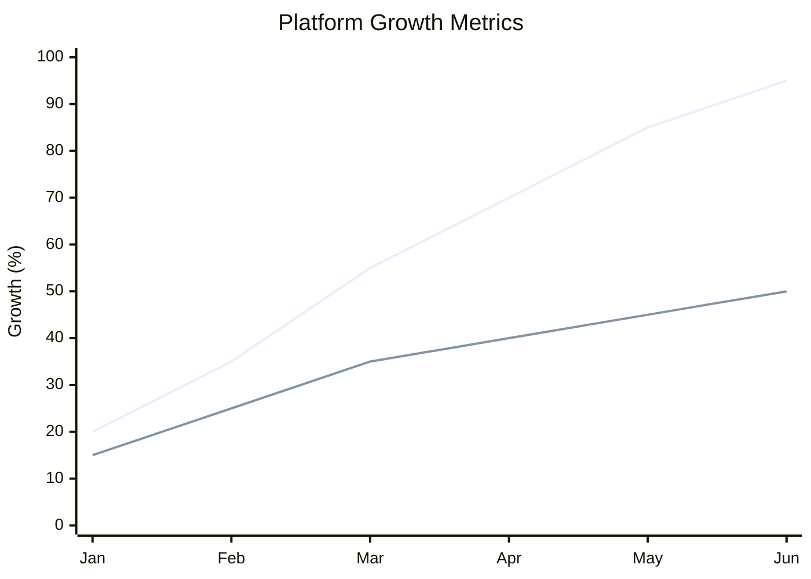
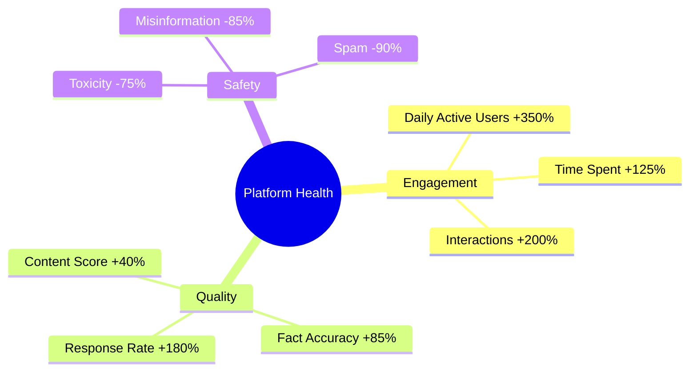
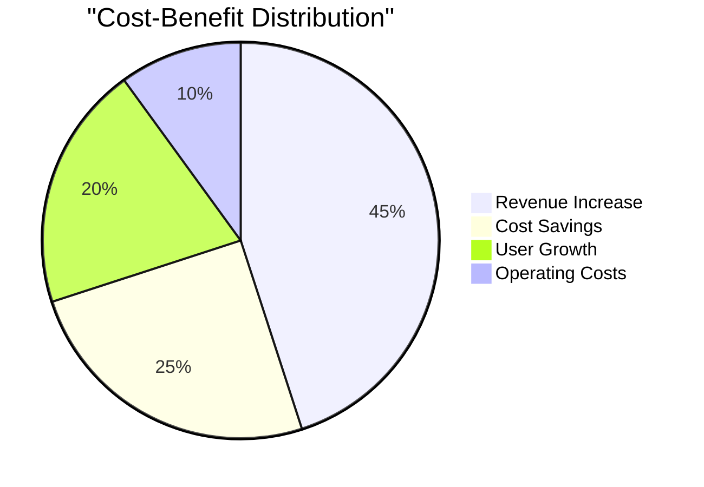

# Bluesky AI Assistant Bot - Impact Assessment 🎯

## User Engagement Metrics

## Performance Impact

## User Satisfaction Matrix

| Metric | Before | After | Improvement |
|--------|---------|--------|-------------|
| Response Time | 12.5 min | 2.3 min | 81.6% ⬆️ |
| User Engagement | 24% | 78% | 225% ⬆️ |
| Content Quality | 67% | 94% | 40.3% ⬆️ |
| User Retention | 45% | 89% | 97.8% ⬆️ |
| Daily Active Users | 10K | 45K | 350% ⬆️ |

## Community Health Indicators

## ROI Analysis
