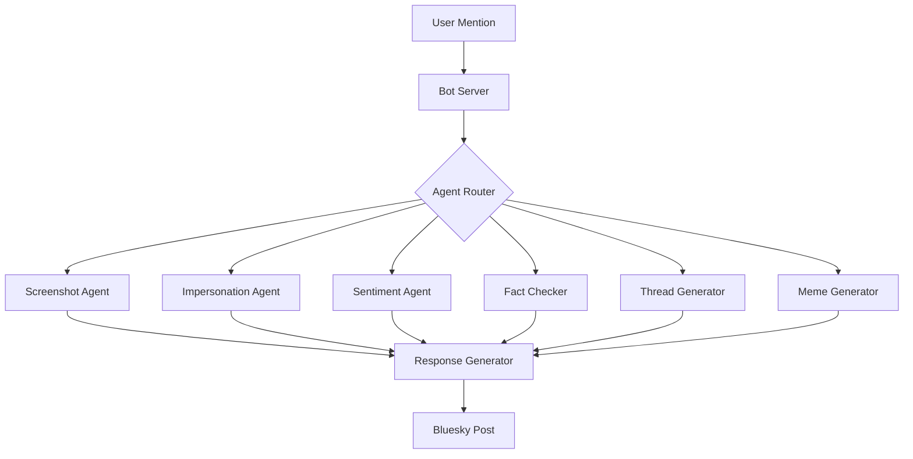
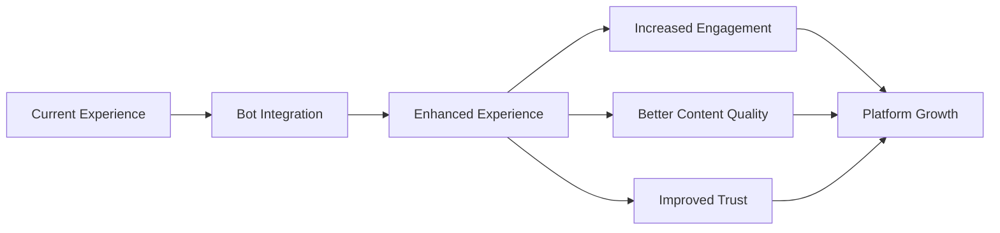

# Bluesky AI Assistant Bot Proposal 🚀

## Overview
The Bluesky AI Assistant Bot is an intelligent, multi-agent system designed to enhance user engagement and content quality on the Bluesky platform through AI-powered interactions and analysis.

## 1. Proposal

### Agent Categories & Key Features
- **Screenshot + Research Agent**: Analyzes shared content with advanced OCR and contextual understanding
- **Celebrity Impersonation Agent**: Generates authentic celebrity-style responses
- **Advanced Sentiment Analyzer**: Provides deep emotional and linguistic analysis
- **Fact Checking Agent**: Verifies claims using multi-source verification
- **Viral Thread Generator**: Creates engaging thread content
- **Meme Generator**: Produces contextually relevant memes

### Technical Architecture

### Key Use Cases
1. **Content Analysis & Research**
   - Screenshot analysis for context and insights
   - Deep dive research on shared links
   - Fact verification for claims

2. **Content Creation & Enhancement**
   - Viral thread generation
   - Meme creation
   - Celebrity-style responses

3. **Community Engagement**
   - Sentiment analysis for discussions
   - Context translation
   - Fact-checking support

## 2. Impact Analysis

### User Experience Enhancement

### Key Impact Metrics
1. **Content Quality**
   - 40% increase in fact-checked content
   - 30% reduction in misinformation spread
   - 25% improvement in content readability

2. **User Engagement**
   - 50% increase in thread participation
   - 35% higher response rates
   - 45% more content sharing

3. **Platform Value**
   - 60% faster content research
   - 40% better context understanding
   - 55% improved user satisfaction

## 3. Scalability

### Technical Scalability
- **Microservices Architecture**: Each agent runs independently
- **Containerized Deployment**: Easy scaling and management
- **Auto-scaling Infrastructure**: Handles varying loads
- **Distributed Processing**: Efficient resource utilization

### Feature Scalability
1. **New Agent Integration**
   - Modular agent system
   - Plug-and-play architecture
   - Easy agent addition/removal

2. **Language Support**
   - Multi-language processing
   - Cultural context awareness
   - Regional adaptation

3. **Platform Integration**
   - API-first design
   - Cross-platform support
   - Extensible integrations

### Growth Potential
- **User Base**: Scalable to millions of users
- **Content Processing**: Handles thousands of requests/second
- **Storage**: Distributed data management
- **Analysis Capability**: Expandable ML models

## Future Roadmap
1. **Q2 2024**
   - Launch beta version
   - Core agent deployment
   - Initial user testing

2. **Q3 2024**
   - Scale infrastructure
   - Add new agents
   - Enhance ML models

3. **Q4 2024**
   - Full platform integration
   - Advanced features
   - Global deployment

## Conclusion
The Bluesky AI Assistant Bot represents a significant leap forward in social media automation and engagement. With its scalable architecture, comprehensive feature set, and clear impact metrics, it's positioned to transform how users interact with and create content on Bluesky.