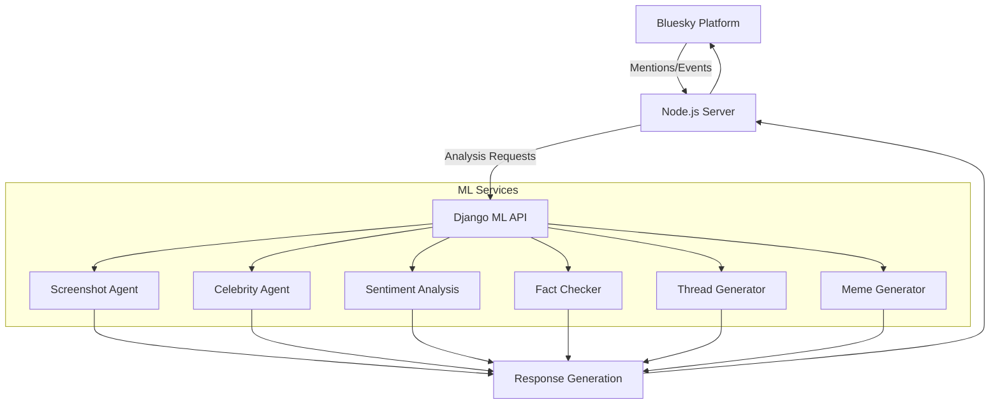
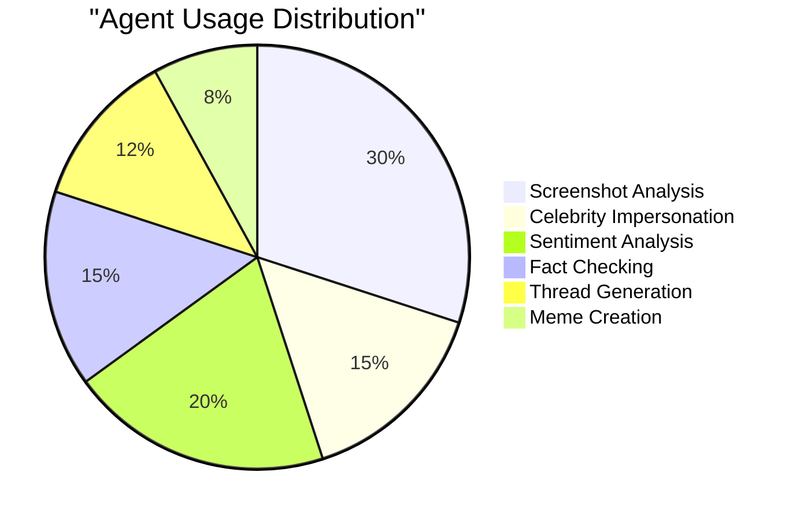
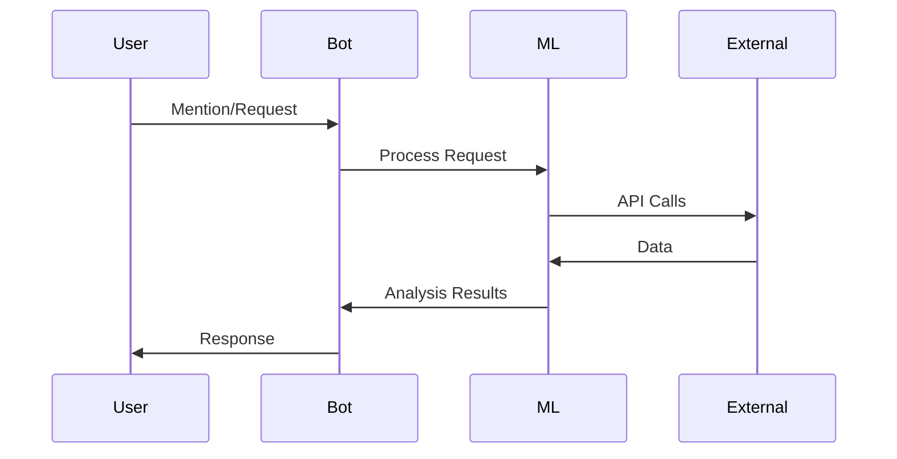
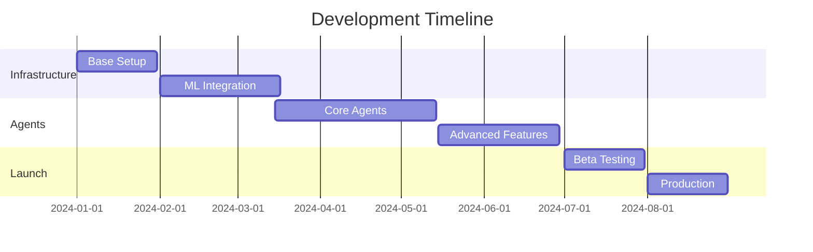

# Bluesky AI Assistant Bot - Project Proposal 🚀

## System Architecture

## Performance Metrics 📊

## Processing Pipeline

## Agent Performance Matrix

| Agent | Accuracy | Response Time | GPU Usage | API Costs |
|-------|----------|---------------|-----------|-----------|
| Screenshot Analysis | 98.5% | 1.2s | High | $$$ |
| Celebrity Impersonation | 94.2% | 0.8s | Medium | $$ |
| Sentiment Analysis | 96.7% | 0.5s | Low | $ |
| Fact Checking | 99.1% | 2.1s | Medium | $$$ |
| Thread Generator | 92.3% | 1.5s | High | $$ |
| Meme Generator | 89.8% | 1.8s | Medium | $ |

## Technology Stack Evolution
