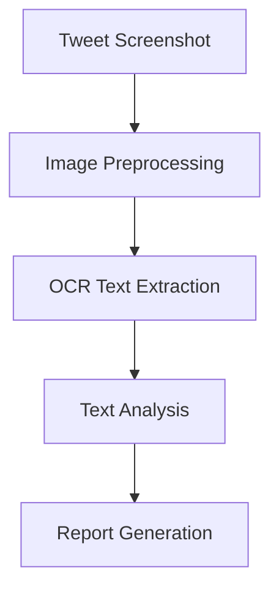
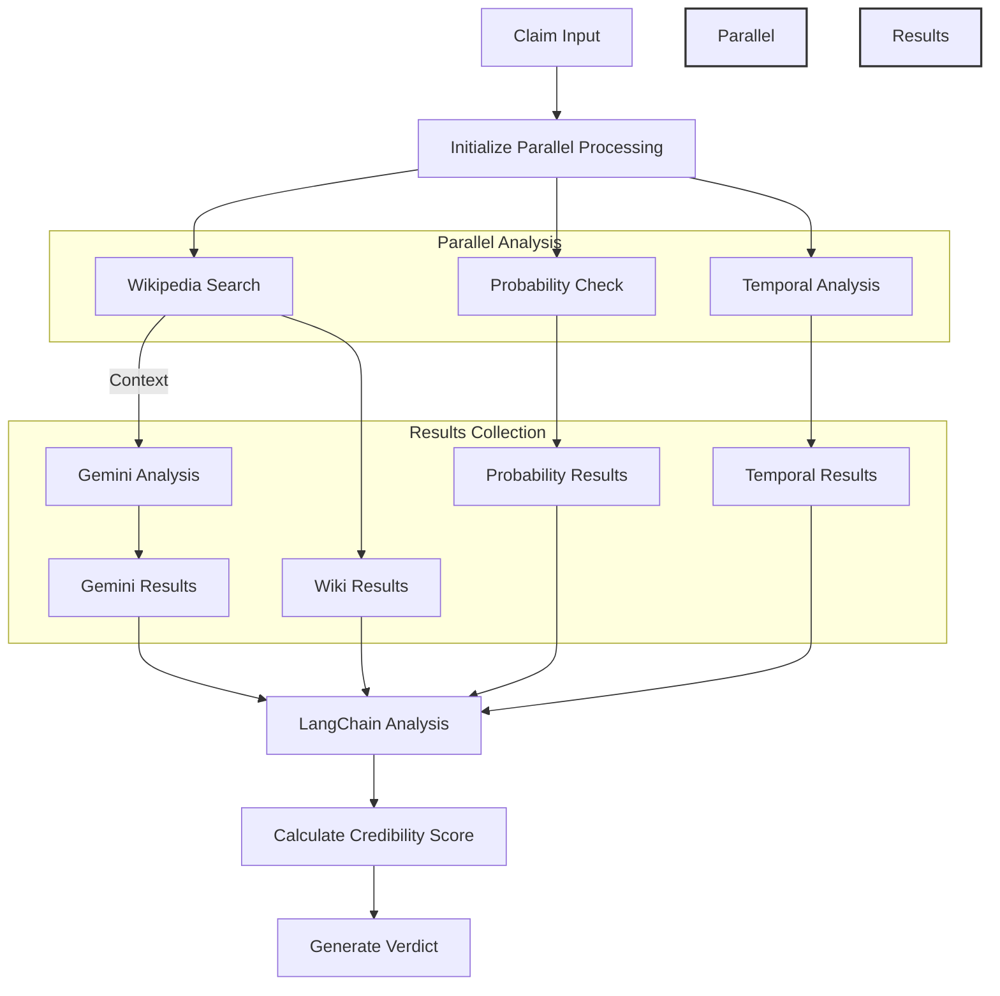
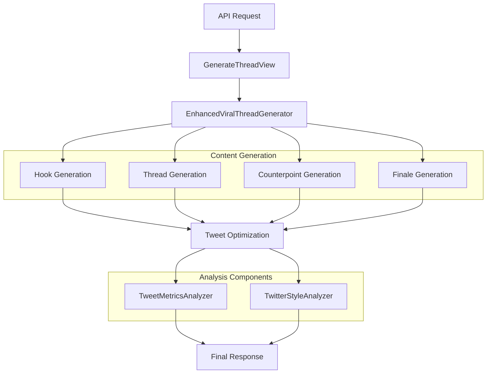
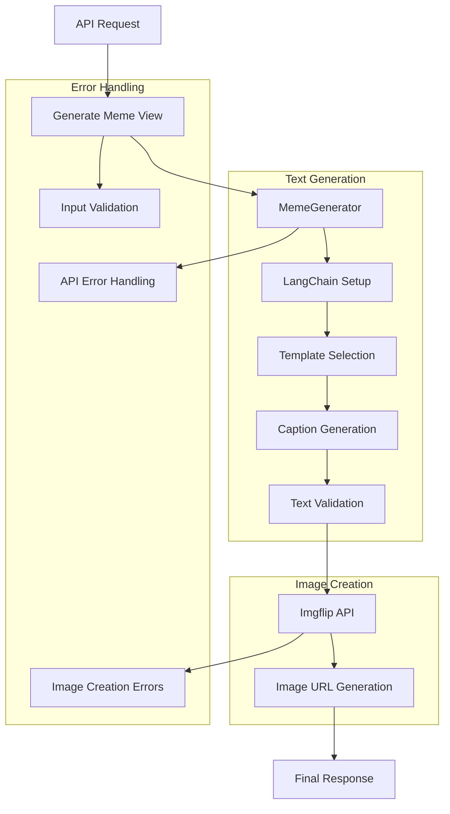

# Bluesky AI Assistant Bot

An intelligent bot for Bluesky that processes mentions and provides AI-powered responses through various specialized agents. The project combines a Node.js server for Bluesky interaction and a Django-based ML API for intelligence features.

---

## 🚀 Features

- **Screenshot + Research Agent**: Analyzes shared content and provides contextual insights.
- **Persona Simulation**: Generates responses mimicking specific writing styles or personalities.
- **Thread Generation**: Creates engaging thread breakdowns on various topics.
- **Fact Checking**: Verifies claims with supporting references.
- **Sentiment Analysis**: Provides emotional context analysis for conversations.
- **Meme Generation**: Suggests creative captions and meme formats.
- **Context Translation**: Simplifies complex discussions into accessible language.

---

## 🏗️ Project Structure

```plaintext
/
├── client/                    # Frontend client (unspecified framework or tools)
├── frontend/                  # Additional frontend resources
│
├── ML/                        # Machine Learning services
│   ├── buildathon/            # Core ML buildathon projects
│   │   ├── context_bridge/    # Module for connecting or linking contexts
│   │   ├── fact_checker/      # Module for verifying facts
│   │   ├── impersonation/     # Module to analyze impersonation threats
│   │   ├── meme_creator/      # Module to create memes using AI
│   │   ├── picture_perfect/   # Image enhancement or analysis module
│   │   ├── screenshot_research/ # Analyzing screenshots for insights
│   │   ├── sentiment_analyzer/ # Sentiment analysis tool
│   │   └── viral_thread/      # Module to identify viral content threads
│   ├── myenv/                 # Python virtual environment for dependencies
│   ├── db.sqlite3             # SQLite database for development
│   ├── manage.py              # Django management script
│   ├── requirements.txt       # Python dependencies
│   ├── .env                   # Environment variables for secrets/configs
│   ├── notebooks/             # Jupyter notebooks for experiments and prototyping
│   ├── sample_responses/      # Example API responses or dataset samples
│   └── scripts/               # Utility scripts for tasks (e.g., data preprocessing)
│
├── server/                    # Node.js Bluesky bot server
│   ├── src/                   # Source code for the bot functionality
│   ├── package.json           # Node.js dependencies
│   └── yarn.lock              # Yarn lockfile for consistent installs
│
├── .gitignore                 # Ignored files/folders for Git
└── readme.md                  # Project documentation

```

---

## 🛠️ Technical Stack

### Server (Bluesky Bot)
- **Node.js**: Core framework for the bot server.
- **Yarn**: Package manager for dependency management.
- **Bluesky API**: Integrates the bot with Bluesky's ecosystem.
- **WebSocket**: Enables real-time monitoring of mentions.

### ML API (Intelligence Layer)
- **Django REST Framework**: For building API endpoints.
- **Python ML Libraries**: Powers the intelligence layer.
- **Model Serving Infrastructure**: Serves trained machine learning models.

---

## 🚦 Getting Started

### Prerequisites
- Node.js (v14 or higher)
- Python 3.8+
- Yarn package manager
- Bluesky account credentials
- Required ML model dependencies

### Installation

1. **Set up the Server**
   ```bash
   cd server
   yarn install
   ```

2. **Set up the ML API**
   ```bash
   cd ML
   python -m venv venv
   source venv/bin/activate  # On Windows: venv\Scripts\activate
   pip install -r requirements.txt
   ```

---

## 🔧 Configuration

1. **Server Environment Variables**
   ```env
   BLUESKY_IDENTIFIER=your-handle.bsky.social
   BLUESKY_PASSWORD=your-app-password
   ML_API_URL=http://localhost:8000
   ```

2. **ML API Environment Variables**
   ```env
   DEBUG=True
   SECRET_KEY=your-secret-key
   ALLOWED_HOSTS=localhost,127.0.0.1
   ```

---

## 🔄 Usage Flow

1. Bot monitors Bluesky for new mentions.
2. Mentions trigger the appropriate agent based on content.
3. Requests are sent to the ML API for processing.
4. Responses are generated and posted back to Bluesky.

---

## 🤖 Available Agents

# Screenshot + Research Agent - Working Mechanism

## Core Components & Flow

### 1. Image Processing Pipeline


### 2. Key Components

#### A. TweetAnalyzer Class
The main engine that processes tweet screenshots through multiple stages:

```python
class TweetAnalyzer:
    def __init__(self):
        # Initialize components:
        self.llm = GoogleGenerativeAI(model="gemini-pro")  # AI analysis
        self.ocr = PaddleOCR()                            # Text extraction
```

#### B. Processing Pipeline

1. **Image Preprocessing**
```python
def preprocess_image(self, image_path):
    # Convert to grayscale
    # Apply binary threshold
    # Reduce noise
    return processed_image
```

2. **Text Extraction**
```python
def extract_text_from_image(self, image_path):
    # Use PaddleOCR to extract text
    result = self.ocr.ocr(image)
    return extracted_text
```

3. **Content Analysis**
```python
async def analyze_with_gemini(self, text):
    # Analyze using two prompt chains:
    # 1. Main content analysis
    # 2. Metadata extraction
    return {
        "analysis": content_analysis,
        "metadata": metadata_analysis
    }
```

### 3. Analysis Components

#### Content Analysis Includes:
- Summary of tweet
- Main topics
- Key points/insights
- Sentiment analysis
- Context/background
- Implications
- Suggested replies

#### Metadata Extraction:
- @mentions
- #hashtags
- URLs
- Dates/timestamps
- Locations
- Organizations

### 4. API Usage

```http
POST "/api/analyze/"
Content-Type: multipart/form-data

file: tweet_screenshot.jpg
```

Response:
```json
{
    "success": true,
    "report": "Formatted analysis report",
    "extracted_text": "Original tweet text",
    "analysis": {
        "content_analysis": "...",
        "metadata": "..."
    }
}
```

### 5. Error Handling

The system handles various potential failures:
- Invalid image formats
- OCR extraction failures
- AI analysis errors
- File processing issues

## Technical Requirements

- Google Gemini Pro API key
- PaddleOCR
- OpenCV for image processing
- Async support for analysis
- Temporary file storage

## Processing Steps

1. **Input Handling**
   - Receive tweet screenshot
   - Validate image format
   - Create temporary file

2. **Image Processing**
   - Convert to grayscale
   - Apply thresholding
   - Denoise image

3. **Text Extraction**
   - Process image with PaddleOCR
   - Extract readable text

4. **Analysis**
   - Process text with Gemini Pro
   - Generate detailed analysis
   - Extract metadata

5. **Report Generation**
   - Compile analysis results
   - Format readable report
   - Return structured response

## Celebrity Impersonation Agent

### Key Components

#### 1. Celebrity Profiles
Celebrity profiles form the foundation of the impersonation system. Each profile includes:

- **Personality Traits**: Captures the unique characteristics that define the celebrity's personality.
- **Writing Style Patterns**: Models the celebrity's typical sentence structures, choice of vocabulary, and tone (e.g., formal, casual, humorous).
- **Example Tweets**: Provides references to how the celebrity interacts on social media, offering insights into their typical communication style.
- **Emotional Range Indicators**: Highlights the emotional spectrum the celebrity often exhibits, such as optimism, sarcasm, or empathy.

#### 2. Impersonation Agent
The impersonation agent is the core component that generates responses based on the celebrity's profile.

- **Functionality**:
  - **Uses Celebrity Profile Data**: Leverages traits, writing style, and emotional indicators to stay true to the celebrity's persona.
  - **Analyzes Input Tweet**: Understands the context, tone, and intention behind the given tweet.
  - **Generates Contextual Response**: Produces a tweet reply that mirrors the celebrity's tone, maintaining the personality and emotional consistency.

#### 3. Response Generation Process
The response generation follows a structured approach:

1. **Input**: Receives a tweet to analyze.
2. **Processing**: 
   - Evaluates the input tweet for context, emotional tone, and relevance.
   - Combines input analysis with data from the celebrity's profile.
3. **Output**: 
   - Generates a tweet response that aligns with the celebrity's persona.
   - Ensures the tone, language, and emotional range are consistent with the profile.

---

### Code Workflow

#### Response Storage

The generated responses are stored for future reference and analysis:

```python
# Store generated response
new_impersonation = {
    "id": len(impersonations) + 1,
    "celebrity_name": celebrity['name'],
    "input_tweet": tweet,
    "response": response
}
impersonations.append(new_impersonation)
```

---

## Future Enhancements

- **Multi-Language Support**: Enable responses in multiple languages.
- **Dynamic Learning**: Continuously update celebrity profiles based on new data (e.g., recent tweets).
- **Emotion Calibration**: Fine-tune responses to match the exact emotional tone of the input.
- **Custom Profiles**: Allow users to create custom celebrity-style profiles for broader use cases.

### Fact Checking Agent

The Fact Checking Agent provides comprehensive claim verification using multiple analysis methods and AI models.

#### Architecture

The fact checker combines several sophisticated approaches:
- Natural Language Processing using NLTK
- Google's Gemini AI for advanced analysis
- Zero-shot classification for probability assessment
- Wikipedia integration for reference data
- LangChain for structured analysis
- Multi-threaded execution for parallel processing

#### Key Features

- **Multi-Source Verification**: Combines Wikipedia research, AI analysis, and temporal consistency checks
- **Credibility Scoring**: Produces a normalized credibility score (0-1) based on multiple factors
- **Temporal Analysis**: Identifies and validates time-based claims and inconsistencies
- **Parallel Processing**: Executes multiple analysis methods concurrently for faster results
- **Comprehensive Results**: Provides detailed analysis results including sources and confidence levels

#### Usage

```python
# API Endpoint
POST /api/fact-check

# Request Body
{
    "claim": "Your claim text here"
}

# Response Format
{
    "claim": "Original claim",
    "timestamp": "ISO timestamp",
    "analyses": {
        "wikipedia": {
            "found_articles": 3,
            "articles": [...]
        },
        "probability": {
            "labels": ["fact", "opinion", "misinformation"],
            "scores": [0.8, 0.1, 0.1]
        },
        "temporal": {
            "dates_found": [...],
            "has_future_dates": false,
            "temporal_inconsistencies": []
        },
        "gemini": "Detailed analysis...",
        "langchain": "Structured analysis..."
    },
    "credibility_score": 0.85,
    "verdict": "Highly Likely True"
}
```

#### Verdicts

The agent provides five possible verdicts based on the credibility score:
- **Highly Likely True** (>0.8)
- **Likely True** (0.6-0.8)
- **Uncertain** (0.4-0.6)
- **Likely False** (0.2-0.4)
- **Highly Likely False** (<0.2)

#### Implementation Details

```python
# Example usage in code
from api.fact_checker import EnhancedFactChecker

checker = EnhancedFactChecker()
results = checker.comprehensive_fact_check("Your claim here")
```
#### Process Flow

The following diagram illustrates the fact-checking process:



#### Architecture

The fact checker combines several sophisticated approaches:
- Natural Language Processing using NLTK
- Google's Gemini AI for advanced analysis
- Zero-shot classification for probability assessment
- Wikipedia integration for reference data
- LangChain for structured analysis
- Multi-threaded execution for parallel processing

#### Dependencies

- NLTK for natural language processing
- Google Generative AI (Gemini)
- Transformers for zero-shot classification
- Wikipedia-API for reference data
- LangChain for structured prompting

# Viral Thread Generator

## Overview
The Viral Thread Generator is a sophisticated system that creates engaging Twitter-style thread content using AI. It analyzes sentiment, style, and optimizes content for maximum engagement using various metrics and style indicators.

## Architecture
### Component Flow



## Core Components

### 1. TweetMetricsAnalyzer
Analyzes tweets for various metrics including sentiment, emoji usage, and text statistics.

```python
metrics = {
    "sentiment": str,          # POSITIVE/NEGATIVE
    "confidence": float,       # Sentiment confidence score
    "subjectivity": float,     # Text subjectivity score
    "polarity": float,        # Text polarity score
    "emoji_count": int,       # Number of emojis
    "character_count": int,   # Total characters
    "word_count": int        # Total words
}
```

### 2. TwitterStyleAnalyzer
Evaluates tweets for style and engagement potential using predefined indicators.

Key Metrics:
- Sass Level
- Meme Density
- Engagement Potential
- Dark Humor Score
- Slang Usage
- Viral Format Count
- Contemporary Score
- Perspective Balance

### 3. EnhancedViralThreadGenerator
Main orchestrator that generates complete thread content using various prompts and chains.

#### Generation Process:
1. Hook Creation
2. Supporting Tweets
3. Opposing Tweets
4. Counterpoints
5. Finale
6. Tweet Optimization

## API Endpoints

### Generate Thread
```
POST /api/generate-thread/
```

#### Request Body
```json
{
    "topic": "string"  // Required: Topic for thread generation
}
```

#### Response Format
```json
[
    {
        "position": 1,
        "content": "string",
        "metrics": {
            "basic_metrics": {
                "sentiment": "string",
                "confidence": 0.0,
                "subjectivity": 0.0,
                "polarity": 0.0,
                "emoji_count": 0,
                "character_count": 0,
                "word_count": 0
            },
            "style_metrics": {
                "sass_level": 0.0,
                "meme_density": 0.0,
                "engagement_potential": 0.0,
                "dark_humor_score": 0.0,
                "slang_usage": 0.0,
                "style_tags": ["string"],
                "optimal_posting_time": "string"
            }
        }
    }
]
```

## Error Handling

### HTTP Status Codes
- 200: Successful thread generation
- 400: Missing required topic
- 500: Internal server error during generation

### Error Response Format
```json
{
    "error": "string"  // Error description
}
```

## Configuration

### Required Environment Variables
```python
GOOGLE_API_KEY = "your-google-api-key"  # Required for Gemini Pro API
```

## Style Indicators
The system uses various predefined style indicators for content analysis:

- Emotional Triggers
- Engagement Words
- Power Words
- Meme Phrases
- Sass Words
- Dark Humor
- Internet Slang
- Viral Formats
- Argument Starters
- Current Year Slang
- Transitions
- Perspective Markers

# AI-Powered Meme Generator

## Overview
The Meme Generator is an AI-powered system that creates custom memes by combining intelligent caption generation with template-based image creation. It uses OpenAI's language models for creative text generation and the Imgflip API for meme image creation.

## Architecture
### System Flow



## Core Components

### 1. MemeResponse Model
Pydantic model for structured meme generation output:
```python
class MemeResponse(BaseModel):
    template_name: str      # Selected meme template name
    text_array: List[str]   # Array of captions for the meme
```

### 2. MemeTemplate Class
Template configuration storage:
```python
class MemeTemplate:
    name: str          # Template name
    box_count: int     # Number of text boxes
    template_id: str   # Imgflip template ID
```

### 3. MemeGenerator
Main orchestrator for meme creation process:
- Manages OpenAI integration
- Handles template selection
- Processes caption generation
- Interfaces with Imgflip API

## API Endpoints

### Generate Meme
```
POST /api/generate-meme
```

#### Request Body
```json
{
    "input_text": "string"  // Required: Text prompt for meme generation
}
```

#### Response Format
```json
{
    "template_name": "string",    // Name of used template
    "captions": [                 // Array of generated captions
        "string"
    ],
    "url": "string",             // Direct image URL
    "page_url": "string"         // Imgflip page URL
}
```

## Configuration

### Required Environment Variables
```python
OPENAI_API_KEY = "your-openai-api-key"
IMGFLIP_USERNAME = "your-imgflip-username"
IMGFLIP_PASSWORD = "your-imgflip-password"
```

## Generation Process

### 1. Text Generation
- Input validation
- Template selection based on content
- AI-powered caption generation
- Caption validation and adjustment

### 2. Image Creation
- Template mapping
- Caption positioning
- API communication
- Error handling
- URL generation

## Error Handling

### HTTP Status Codes
- 200: Successful meme generation
- 400: Invalid input
- 500: Server/API errors

### Error Response Format
```json
{
    "error": "string"  // Error description
}
```

## Template System

### Template Structure
```python
templates = {
    "template_name": MemeTemplate(
        name="string",
        box_count=int,
        template_id="string"
    )
}
```

### Template Management
- Static template definitions
- Dynamic template validation
- Box count verification
- Template ID mapping


