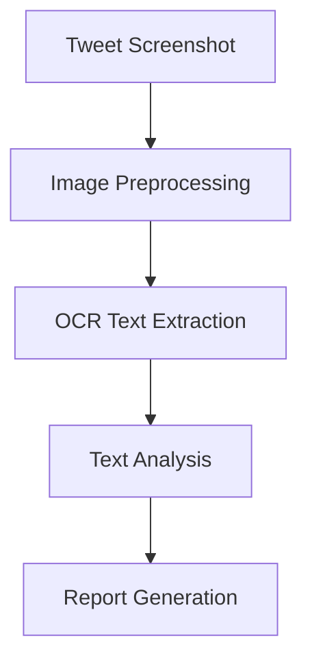

# Bluesky AI Assistant Bot

An intelligent bot for Bluesky that processes mentions and provides AI-powered responses through various specialized agents. The project combines a Node.js server for Bluesky interaction and a Django-based ML API for intelligence features.

---

## 🚀 Features

- **Screenshot + Research Agent**: Analyzes shared content and provides contextual insights.
- **Persona Simulation**: Generates responses mimicking specific writing styles or personalities.
- **Thread Generation**: Creates engaging thread breakdowns on various topics.
- **Fact Checking**: Verifies claims with supporting references.
- **Sentiment Analysis**: Provides emotional context analysis for conversations.
- **Meme Generation**: Suggests creative captions and meme formats.
- **Context Translation**: Simplifies complex discussions into accessible language.

---

## 🏗️ Project Structure

```plaintext
/
├── server/          # Node.js Bluesky Bot Server
│   ├── src/         # Source code
│   ├── package.json # Dependencies
│   └── yarn.lock    # Yarn lockfile
│
└── ML/             # Django ML API Service
    ├── api/        # API endpoints
    ├── models/     # ML models
    └── manage.py   # Django management script
```

---

## 🛠️ Technical Stack

### Server (Bluesky Bot)
- **Node.js**: Core framework for the bot server.
- **Yarn**: Package manager for dependency management.
- **Bluesky API**: Integrates the bot with Bluesky's ecosystem.
- **WebSocket**: Enables real-time monitoring of mentions.

### ML API (Intelligence Layer)
- **Django REST Framework**: For building API endpoints.
- **Python ML Libraries**: Powers the intelligence layer.
- **Model Serving Infrastructure**: Serves trained machine learning models.

---

## 🚦 Getting Started

### Prerequisites
- Node.js (v14 or higher)
- Python 3.8+
- Yarn package manager
- Bluesky account credentials
- Required ML model dependencies

### Installation

1. **Set up the Server**
   ```bash
   cd server
   yarn install
   ```

2. **Set up the ML API**
   ```bash
   cd ML
   python -m venv venv
   source venv/bin/activate  # On Windows: venv\Scripts\activate
   pip install -r requirements.txt
   ```

---

## 🔧 Configuration

1. **Server Environment Variables**
   ```env
   BLUESKY_IDENTIFIER=your-handle.bsky.social
   BLUESKY_PASSWORD=your-app-password
   ML_API_URL=http://localhost:8000
   ```

2. **ML API Environment Variables**
   ```env
   DEBUG=True
   SECRET_KEY=your-secret-key
   ALLOWED_HOSTS=localhost,127.0.0.1
   ```

---

## 🔄 Usage Flow

1. Bot monitors Bluesky for new mentions.
2. Mentions trigger the appropriate agent based on content.
3. Requests are sent to the ML API for processing.
4. Responses are generated and posted back to Bluesky.

---

## 🤖 Available Agents

# Screenshot + Research Agent - Working Mechanism

## Core Components & Flow

### 1. Image Processing Pipeline


### 2. Key Components

#### A. TweetAnalyzer Class
The main engine that processes tweet screenshots through multiple stages:

```python
class TweetAnalyzer:
    def __init__(self):
        # Initialize components:
        self.llm = GoogleGenerativeAI(model="gemini-pro")  # AI analysis
        self.ocr = PaddleOCR()                            # Text extraction
```

#### B. Processing Pipeline

1. **Image Preprocessing**
```python
def preprocess_image(self, image_path):
    # Convert to grayscale
    # Apply binary threshold
    # Reduce noise
    return processed_image
```

2. **Text Extraction**
```python
def extract_text_from_image(self, image_path):
    # Use PaddleOCR to extract text
    result = self.ocr.ocr(image)
    return extracted_text
```

3. **Content Analysis**
```python
async def analyze_with_gemini(self, text):
    # Analyze using two prompt chains:
    # 1. Main content analysis
    # 2. Metadata extraction
    return {
        "analysis": content_analysis,
        "metadata": metadata_analysis
    }
```

### 3. Analysis Components

#### Content Analysis Includes:
- Summary of tweet
- Main topics
- Key points/insights
- Sentiment analysis
- Context/background
- Implications
- Suggested replies

#### Metadata Extraction:
- @mentions
- #hashtags
- URLs
- Dates/timestamps
- Locations
- Organizations

### 4. API Usage

```http
POST /analyze_tweet/
Content-Type: multipart/form-data

file: tweet_screenshot.jpg
```

Response:
```json
{
    "success": true,
    "report": "Formatted analysis report",
    "extracted_text": "Original tweet text",
    "analysis": {
        "content_analysis": "...",
        "metadata": "..."
    }
}
```

### 5. Error Handling

The system handles various potential failures:
- Invalid image formats
- OCR extraction failures
- AI analysis errors
- File processing issues

## Technical Requirements

- Google Gemini Pro API key
- PaddleOCR
- OpenCV for image processing
- Async support for analysis
- Temporary file storage

## Processing Steps

1. **Input Handling**
   - Receive tweet screenshot
   - Validate image format
   - Create temporary file

2. **Image Processing**
   - Convert to grayscale
   - Apply thresholding
   - Denoise image

3. **Text Extraction**
   - Process image with PaddleOCR
   - Extract readable text

4. **Analysis**
   - Process text with Gemini Pro
   - Generate detailed analysis
   - Extract metadata

5. **Report Generation**
   - Compile analysis results
   - Format readable report
   - Return structured response

## Celebrity Impersonation Agent

### Key Components

#### 1. Celebrity Profiles
Celebrity profiles form the foundation of the impersonation system. Each profile includes:

- **Personality Traits**: Captures the unique characteristics that define the celebrity's personality.
- **Writing Style Patterns**: Models the celebrity's typical sentence structures, choice of vocabulary, and tone (e.g., formal, casual, humorous).
- **Example Tweets**: Provides references to how the celebrity interacts on social media, offering insights into their typical communication style.
- **Emotional Range Indicators**: Highlights the emotional spectrum the celebrity often exhibits, such as optimism, sarcasm, or empathy.

#### 2. Impersonation Agent
The impersonation agent is the core component that generates responses based on the celebrity's profile.

- **Functionality**:
  - **Uses Celebrity Profile Data**: Leverages traits, writing style, and emotional indicators to stay true to the celebrity's persona.
  - **Analyzes Input Tweet**: Understands the context, tone, and intention behind the given tweet.
  - **Generates Contextual Response**: Produces a tweet reply that mirrors the celebrity's tone, maintaining the personality and emotional consistency.

#### 3. Response Generation Process
The response generation follows a structured approach:

1. **Input**: Receives a tweet to analyze.
2. **Processing**: 
   - Evaluates the input tweet for context, emotional tone, and relevance.
   - Combines input analysis with data from the celebrity's profile.
3. **Output**: 
   - Generates a tweet response that aligns with the celebrity's persona.
   - Ensures the tone, language, and emotional range are consistent with the profile.

---

### Code Workflow

#### Response Storage

The generated responses are stored for future reference and analysis:

```python
# Store generated response
new_impersonation = {
    "id": len(impersonations) + 1,
    "celebrity_name": celebrity['name'],
    "input_tweet": tweet,
    "response": response
}
impersonations.append(new_impersonation)
```

---

## Future Enhancements

- **Multi-Language Support**: Enable responses in multiple languages.
- **Dynamic Learning**: Continuously update celebrity profiles based on new data (e.g., recent tweets).
- **Emotion Calibration**: Fine-tune responses to match the exact emotional tone of the input.
- **Custom Profiles**: Allow users to create custom celebrity-style profiles for broader use cases.