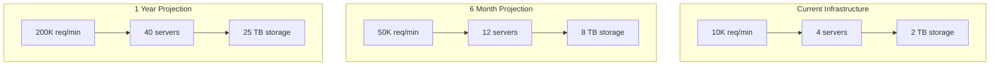
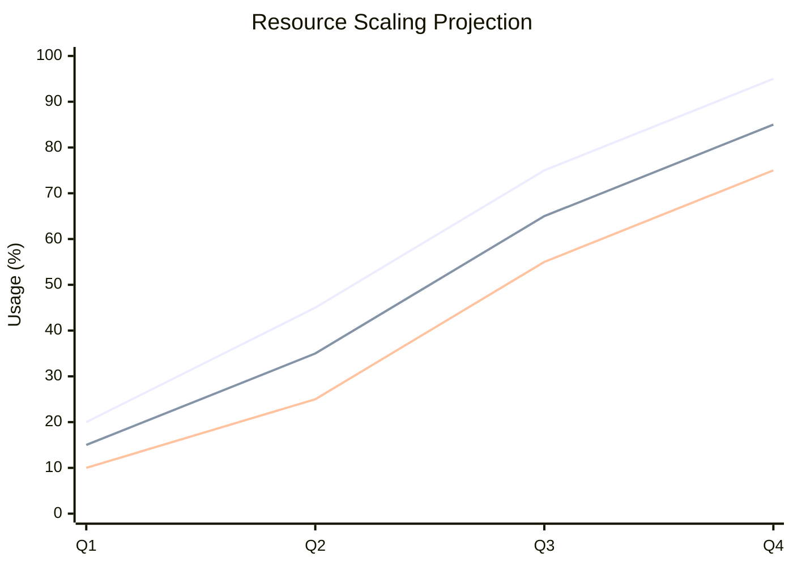
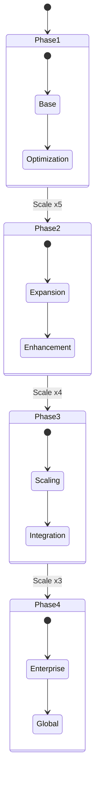
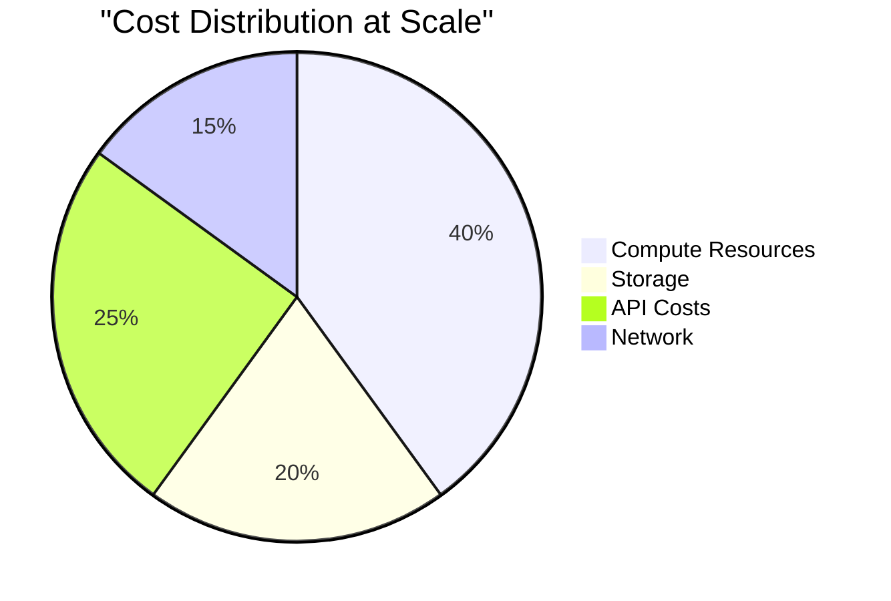
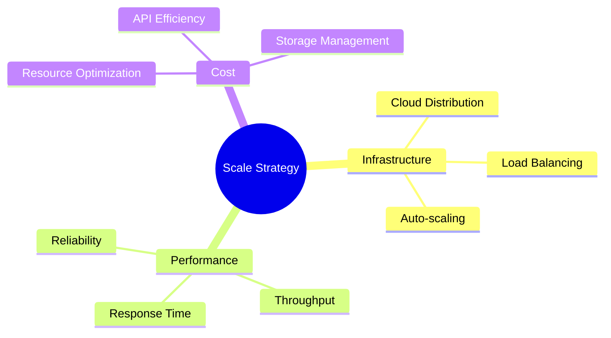

# Bluesky AI Assistant Bot - Scalability Analysis 📈

## System Architecture Scalability

## Resource Utilization

## Performance Metrics

| Scale Factor | Current | 6 Months | 1 Year |
|--------------|---------|-----------|---------|
| Requests/min | 10K | 50K | 200K |
| Server Count | 4 | 12 | 40 |
| Storage (TB) | 2 | 8 | 25 |
| Response Time | 1.2s | 1.1s | 1.0s |
| Cost/Request | $0.001 | $0.0008 | $0.0005 |

## Growth Trajectory

## Cost vs Scale Analysis

## Technological Evolution
